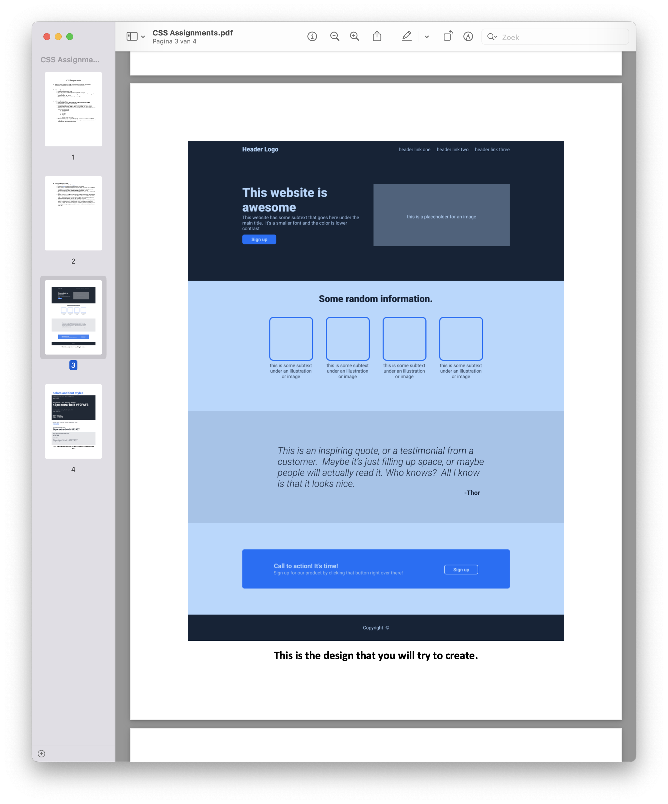

_Brainnest Frontend Industry Training_

---

# CSS

## Assignment 4 - Project

1. Download the ‘Roboto’ font from [here](https://fonts.google.com/specimen/Roboto)
2. Check out [here](https://www.youtube.com/watch?v=AAU25Fo4bFY) on how to use that font you just downloaded
3. Have a look at the two images below *(3rd/4th) page of this document)*. One is the design
that you will try to copy, it should look as similar as possible. The second one shows
some information like colors and **font-weights**design you should use in texts.
4. Do not worry about this being responsive on mobile devices or not, that is not the goal
here
5. For the section you’re working on, begin by getting all the content onto the page before
beginning to style it. In other words, do the HTML and then do the CSS. You’ll probably have to go back to the HTML once you start styling, but bouncing back and forth from the beginning will take more time and may cause more frustration.
6. There are many ways to tackle a project like this, and it can be overwhelming to look at a blank HTML document and not know where to start. Our suggestion: take it one section at a time. The website you’re creating has 4 main sections (and a footer), so pick one and get it into pretty good shape before moving on. Starting at the top is always a solid plan.

